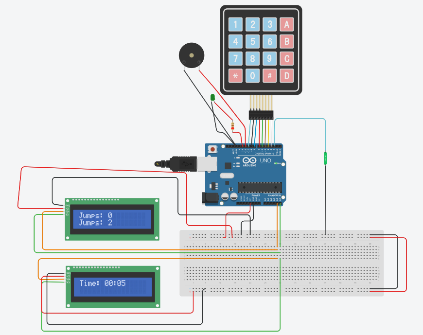

# 🚀 Jump Counter with Level Selection – Arduino Uno R3

## 📋 Project Summary

This project is a **Smart Jump Rope Counter** built using Arduino Uno R3, designed to encourage physical activity in a fun and interactive way.

- 🧠 Users choose a difficulty level (1 to 5)  
- ⏱️ Each level has a specific jump goal and time duration  
- 📟 Real-time feedback via LCDs and LEDs  
- 🔔 Buzzer alerts when the goal is reached  

**🎯 The goal:** Promote fitness and consistency by tracking jumps with increasing difficulty.

---

## 🔧 Components Used

- 🧠 Arduino Uno R3  
- 📟 LCD I2C Display x2 (16x2)  
- 🎛️ Keypad 4x4  
- 🌀 Tilt Sensor  
- 💡 Green LED  
- 🔊 Buzzer  
- 🔌 Breadboard  
- 🔗 Jumper Wires  

---

## 🖼️ Circuit Diagram

📌 The following image shows the full schematic of the jump counting circuit, including all components and connections:

---

## 🎥 Demo Video

▶️ A demonstration of the system in action:  
*(insert video link or upload here)*

---

## ⚙️ How It Works

1. The user selects a level using the keypad (1–5)  
2. Each level has a predefined jump goal and timer (1 minute or 1:20 minutes)  
3. The tilt sensor detects valid jump motions  
4. LCD1 displays jump count; LCD2 shows remaining time  
5. When the goal is reached – the buzzer beeps and green LED lights up  
6. After each session, the user can choose to continue, change level, or exit  

---

🎉 This project combines fitness, electronics, and real-time feedback – all in one!
